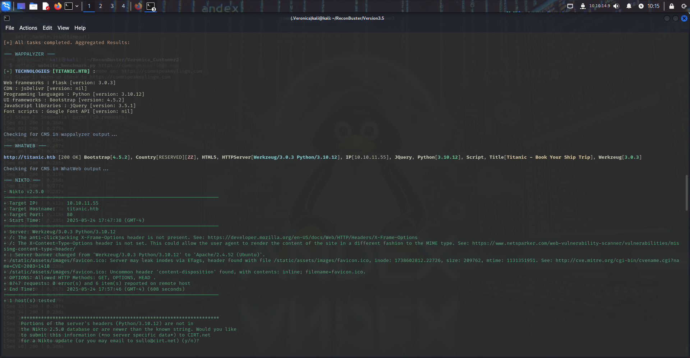
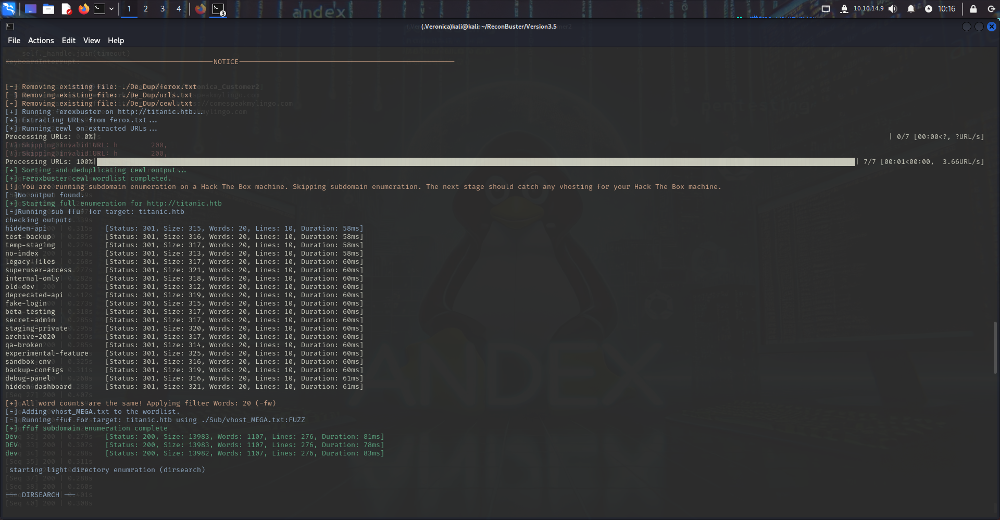

# Veronica

**Veronica** is an automated reconnaissance tool designed for pentesters, bug bounty hunters, and anyone who works full-time and needs something to run while there at work or sleeping.  
Start it, go to sleep, and wake up with a full attack surface mapped out — CMS info, directories, CVEs, and more.

---

# Features

- Web recon (HTTP/HTTPS)
- CMS
- Subdomain & directory brute-forcing (auto applies filters)
- CVE enumeration
- Custom wordlist with Cewl

---

##  Getting Started

###  Kali-Only Setup (for now)

```bash
sudo apt update
sudo apt install -y python3 python3-venv python3-pip nikto whatweb feroxbuster ffuf dirsearch curl unzip subfinder
```

## Clone and Setup
```bash
git clone https://github.com/johnnyvims/Veronica.git
cd Veronica
unzip Sub/vhost_MEGA.txt.zip
python3 -m venv .Veronica
source .Veronica/bin/activate
pip install --upgrade pip
pip install -r requirements.txt
```

---

## Usage
```bash
python3 ReconBuster.py
```

---

## Sample Output

Here’s an example of Veronica’s recon output:




